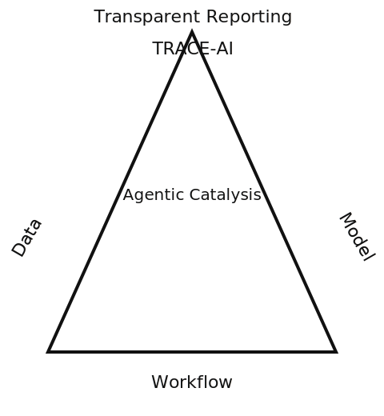

# TRACE-AI Checklist Repo

Tools and templates that accompany the TRACE-AI manuscript (Transparent Reporting for Agentic Catalysis Enabled by AI). Use these files to prepare the publication checklist, agent cards, data manifests, and autonomy logs that make agentic catalysis campaigns auditable.



## Contents
- `checklist/trace-ai-checklist.md` — canonical checklist table (A1–D3) ready to fill.  
- `checklist/trace-ai-checklist.json` — machine-readable checklist for automation.  
- `templates/agent-card-template.md` — describe each agent/policy.  
- `templates/data-manifest-template.yaml` — capture dataset provenance and processing.  
- `templates/autonomy-run-log-template.md` — log closed-loop runs, safety events, and outcomes.  
- `docs/getting-started.md` — quick instructions for authors, reviewers, and editors.  
- `docs/manuscript-mapping.md` — suggests where to place evidence in the manuscript/SI.  
- `.github/ISSUE_TEMPLATE/trace-ai-checklist.md` — issue template for submitting filled checklists.  
- `assets/trace-ai-triangle.svg` — simple figure illustrating the Data–Model–Workflow triad.  
- `LICENSE` — CC-BY-4.0 for all text/templates.  

## Quickstart
1. Copy `checklist/trace-ai-checklist.md` into your project or SI.  
2. Fill `Status`, `Evidence`, and `Notes` for each item. Cite stable artifacts (section numbers, DOIs, commit hashes).  
3. Complete relevant templates:
   - Agent details → `templates/agent-card-template.md`
   - Dataset provenance → `templates/data-manifest-template.yaml`
   - Closed-loop execution → `templates/autonomy-run-log-template.md`
4. (Optional) Export the filled checklist to PDF:  
   ```bash
   pandoc checklist/trace-ai-checklist.md -o trace-ai-checklist.pdf
   ```
5. Submit via the provided issue template or your journal’s SI.

## Versioning
- Current version: 0.1.0 (2026-01-29). See `CHANGELOG.md` for updates. Cite the version used in your manuscript.

## Contributing
Pull requests and issues are welcome (check the issue template). Please keep changes aligned with the TRACE-AI guideline scope (data, model, workflow transparency for agentic catalysis).
